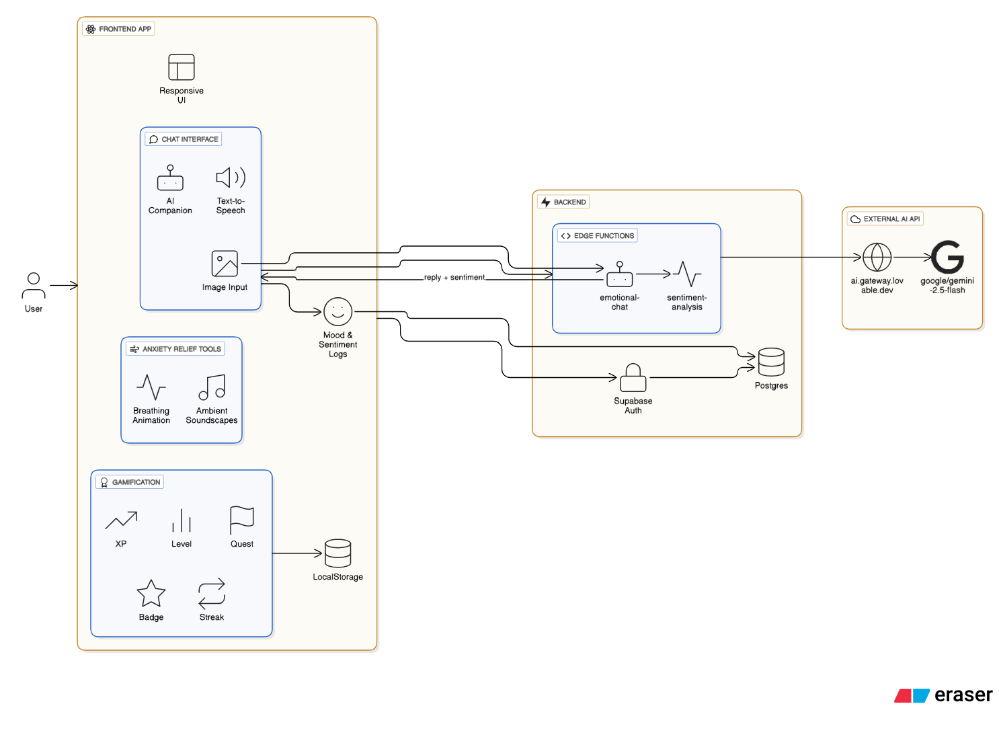

# The Silent Stress 🤖

AI-powered emotional wellness companion built with Vite + React + TypeScript, TailwindCSS, and shadcn/ui. Uses Supabase for auth, data, and edge functions.


## Overview 🚀

The Silent Stress is an AI-powered emotional wellness companion that helps users reflect, feel heard, and build healthier habits. It combines an empathetic chat experience, gentle guardrails, mood logging, and gamified micro-activities to support day-to-day wellbeing.

##  Flow Diagram ‼️



## Features 💫

- **AI companion chat** with image input and on-page formatting
- **Text-to-speech playback** for assistant responses
- **Guardrailed responses** focused on wellness; off-topic or diagnostic content is gently redirected
- **Sentiment analysis** and logging to track patterns over time
- **Intervention suggestions**: music, journaling, mindfulness, breathing, or professional help
- **Gamification**: levels, XP, streaks, badges, daily quests, and conversation streak tracking
- **Anxiety relief** page with breathing patterns and ambient sounds (Forest, Ocean, Garden)
- **Responsive UI** with a landing page, theme switcher, and polished components

## Tech Stack ⚙️

- React 18 + TypeScript + Vite (port 8080)
- TailwindCSS + shadcn/ui + Radix primitives
- React Router, TanStack Query
- Supabase (Auth, Postgres, Edge Functions)

## Project Structure

```
├─ index.html
├─ src/
│  ├─ App.tsx                    # Routing and providers
│  ├─ main.tsx                   # App bootstrap
│  ├─ components/
│  │  ├─ Landing.tsx             # Marketing/entry with auth toggle
│  │  ├─ Dashboard.tsx           # Signed-in experience hub
│  │  ├─ ChatInterface.tsx       # Chat UI, image input, TTS, logging
│  │  ├─ AnxietyRelief.tsx       # Breathing + ambient sounds
│  │  └─ ui/                     # shadcn/ui components
│  ├─ pages/
│  │  ├─ Index.tsx               # Auth gate: Landing or Dashboard
│  │  ├─ Anxiety.tsx             # /anxiety route
│  │  ├─ Gamification.tsx        # /gamification route
│  │  └─ NotFound.tsx            # 404 fallback
│  ├─ integrations/
│  │  └─ supabase/
│  │     ├─ client.ts            # Supabase client (generated)
│  │     └─ types.ts             # Supabase DB types
│  └─ lib/
│     └─ gamification.ts         # Local XP/quests/streaks logic
├─ supabase/functions/emotional-chat/index.ts  # Edge function (Deno)
├─ tailwind.config.ts | postcss.config.js | vite.config.ts
├─ package.json | tsconfig*.json
└─ .env (local development only)
```

## Quick Start

```bash
git clone <repo>
cd whisper-wellbeing-ai
npm install
cp .env.example .env   # or create .env and fill variables from the section below
npm run dev             # open http://localhost:8080
```

If you don’t have Supabase set up yet, you can still explore the UI. Chat and data features require a configured Supabase project and the deployed edge function.

## Prerequisites

- Node.js 18+
- A Supabase project
- Supabase CLI (for deploying the edge function): https://supabase.com/docs/guides/cli

## Environment Variables

Create a `.env` at the project root. The app reads the following:

```
VITE_SUPABASE_PROJECT_ID=<PROJECT_ID>
VITE_SUPABASE_URL=<your_supabase_url>
VITE_SUPABASE_PUBLISHABLE_KEY=<your_supabase_anon_key>
```

Notes:

- The client uses `VITE_SUPABASE_PUBLISHABLE_KEY` (publishable/anon key) as configured in `src/integrations/supabase/client.ts`.
- Do not commit real keys to version control.

## Supabase Setup

Create the tables below (names and columns align with `src/integrations/supabase/types.ts`). Adjust types/constraints as needed.

```sql
-- Conversations a user holds with the assistant
create table if not exists public.conversations (
  id uuid primary key default gen_random_uuid(),
  user_id uuid not null,
  title text,
  created_at timestamptz not null default now(),
  updated_at timestamptz not null default now()
);

-- Messages in a conversation (user or assistant)
create table if not exists public.messages (
  id uuid primary key default gen_random_uuid(),
  conversation_id uuid not null references public.conversations (id) on delete cascade,
  role text not null, -- 'user' | 'assistant'
  content text not null,
  sentiment_score double precision,
  sentiment_label text,
  created_at timestamptz not null default now()
);

-- Mood logs derived from conversations
create table if not exists public.mood_logs (
  id uuid primary key default gen_random_uuid(),
  user_id uuid not null,
  sentiment_score double precision not null,
  sentiment_label text not null,
  triggers text[],
  created_at timestamptz not null default now()
);

-- Suggested interventions for a user (optional tasks)
create table if not exists public.interventions (
  id uuid primary key default gen_random_uuid(),
  user_id uuid not null,
  intervention_type text not null, -- music|journaling|mindfulness|breathing|professional_help
  title text not null,
  description text,
  completed boolean default false,
  created_at timestamptz not null default now()
);
```

RLS: enable Row Level Security and add policies so users can only access their own rows. Example:

```sql
alter table public.conversations enable row level security;
alter table public.messages enable row level security;
alter table public.mood_logs enable row level security;
alter table public.interventions enable row level security;

create policy "own conversations" on public.conversations
  for all using (auth.uid() = user_id) with check (auth.uid() = user_id);

create policy "own messages" on public.messages
  for all using (
    exists (
      select 1 from public.conversations c
      where c.id = conversation_id and c.user_id = auth.uid()
    )
  );

create policy "own mood logs" on public.mood_logs
  for all using (auth.uid() = user_id) with check (auth.uid() = user_id);

create policy "own interventions" on public.interventions
  for all using (auth.uid() = user_id) with check (auth.uid() = user_id);
```

## Edge Function: emotional-chat

The edge function at `supabase/functions/emotional-chat/index.ts`:

- Accepts chat history and optional image (Base64) from the client
- Calls an AI model for a compassionate reply
- Performs a secondary call to analyze sentiment and returns a structured object
- Adds CORS headers and handles rate/credit errors gracefully

Required secret in your Supabase project:

- `LOVABLE_API_KEY` (used to call `https://ai.gateway.lovable.dev/v1/chat/completions`)

Deploy with Supabase CLI (example):

```bash
supabase functions deploy emotional-chat
supabase secrets set LOVABLE_API_KEY=your_api_key
```

The client invokes it via `supabase.functions.invoke("emotional-chat", { body: { ... } })`.

## Local Development ‼️

```bash
npm install
npm run dev
```

The dev server runs at http://localhost:8080

Build and preview:

```bash
npm run build
npm run preview
```

## Public Assets (Sounds)

Ambient sound files used in the Anxiety Relief page are included under `public/sounds`:

- `public/sounds/forest.wav`
- `public/sounds/ocean.wav`
- `public/sounds/grass.wav`

These are preloaded and looped by the UI. If you replace them, keep filenames and formats consistent or update `AnxietyRelief.tsx` accordingly.

## Usage Guide

- **Auth & Landing**: From the home page, click Get Started to sign up/in.
- **Dashboard & Chat**: Start a conversation. You can attach an image and enable TTS on assistant replies.
- **Gamification**: Visit `/gamification` to see level, XP, daily quests, badges, and conversation streak.
- **Anxiety Relief**: Visit `/anxiety` for guided breathing and ambient soundscapes.

Routes:

- `/` root: shows Landing for signed-out users, Dashboard for signed-in users
- `/gamification`
- `/anxiety`
- `*` 404 page

## Accessibility & Browser Support

- TTS uses `window.speechSynthesis` (works best in Chromium-based browsers)
- Ensure microphone/media permissions if you add speech recognition in the future

## Security & Privacy

- Do not store secrets in the frontend repository
- Enable RLS and restrict access by `auth.uid()`
- Logged mood and interventions are minimal and user-scoped

## Troubleshooting

- "AI credits depleted" or 402 from the edge function: top up or replace `LOVABLE_API_KEY`
- 429 rate limits: retry after a short delay
- Supabase 401/403: check the anon/publishable key and RLS policies
- Blank chat responses: verify edge function logs and ensure the `LOVABLE_API_KEY` is set
- Dev server not accessible: ensure nothing else is bound to port 8080

## Scripts

- `npm run dev` start dev server
- `npm run build` production build
- `npm run preview` preview production build

